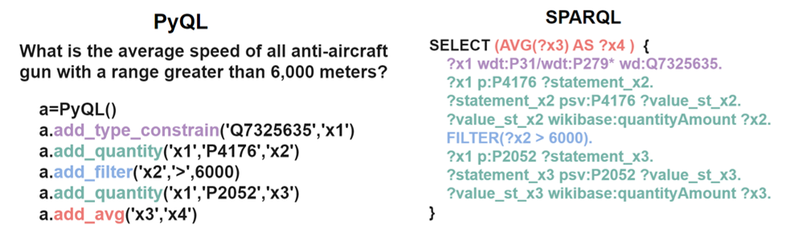

# Introduction of PyQL

PyQL (Pythonic Query Language for SPARQL), a logical form written in Python as a reasoning step representation for numerical reasoning question(NRQ).

PyQL encapsulates various SPARQL syntax elements, such as Basic Graph Patterns, Assignments, Filters, Aggregations, and Subqueries.

A PyQL is a sequence of commands: $$\{c_{1},c_{2}, ..., c_{n}\}$$, where $$c_{i}$$ either initializes a PyQL object or calls a function on the object.&#x20;

```python
# initializes a PyQL object
a=PyQL() 
# call a function to add type constrain 
a.add_type_constrain('Q3624078', 'x0')
# get the value of a quantity property of x0 with the time constrained within year 2020 
a.add_quantity("x0",'P1082','x1',2020) 
# get the maximum value among all the values of variable x1
a.add_max('x1','x1') 
```

When write a PyQL, you need to first initialize a PyQL object and sequentially add functions to construct the whole query.

Each function represents a reasoning step such as stating the relation between two entities or computing the average.

A valid PyQL can directly generate an executable SPARQL query.

<figure><figcaption></figcaption></figure>
